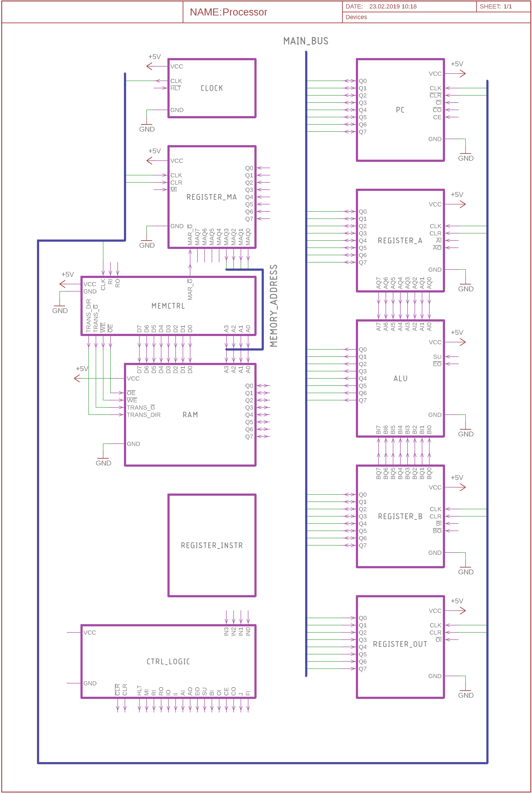

# Yet Another SAP-1 based 8-bit computer

An 8-bit computer based on [Ben Eaters version of SAP-1](https://eater.net/8bit) modified to use larger parallel flash/RAM for future upgrades.

## Hardware description

YASAP-1 consists of the following blocks:

* 4-bit Program Counter
* 8-bit Register A (First operand)
* 8-bit Arithmetic Logic Unit with following functions:
	* A + B
	* A - B
	* Carry and Zero flags
* 8-bit Register B (Second operand)
* 8-bit Output register with 4 digit 7-segment display
* Clock with manual step mode
* 4-bit Memory Address Register
* 16 x 8-bit SRAM
* Memory controller for writing user data to RAM
* 8-bit Instruction Register
* Control logic 

